# Deliverable 6 — Architecture Diagrams

**KB J Capital Co., Ltd. — Corporate Intranet & Public Sync Portal**

**Version:** 1.1.0 · **Status:** Draft (W2-1 truth revision) · **Date:** 2026-09-10 · **Author:** worker-3 → Lead review → CTO approval (W2-1 truth pass: worker-3)

> **Change log** — **1.1.0 (2026-09-10)**: W2-1 truth pass (align to the landed branch code): §3 state machine and §5.2 sequence diagram rewritten to the **single legal path** — the Wave-1 direct-publish bypass (PATH A, DCR-3) is closed by FR-NEWS-009 (workflow fields stripped at the validation layer, submit draft-only, approve/reject pending-only, submitter ≠ approver for every role, forced edit-reset audited AUD-P01; sync log written only by approve); appendix source-mapping line references re-baselined. Line references are a snapshot of the Wave-2 working tree (worker-2's W2-3 audit-coverage work is in flight on this branch; its behavior is documented in Doc 10 §9.1 and not restated here — expect minor drift until W2-3 lands). **1.0.0**: initial AS-BUILT record (Wave-1 gate, approved) — its diagrams documented the then-live dual-path behavior.

---

## Contents

1. [System context diagram (C4 Level 1)](#1-system-context-diagram-c4-level-1)
2. [Container diagram (C4 Level 2)](#2-container-diagram-c4-level-2)
3. [Component diagram — server.ts (C4 Level 3)](#3-component-diagram--serverts-c4-level-3)
4. [Deployment diagrams](#4-deployment-diagrams)
   - 4.1 Kubernetes (production target)
   - 4.2 Docker Compose (single host)
5. [Dynamic views — sequence diagrams](#5-dynamic-views--sequence-diagrams)
   - 5.1 Login (rate limit, bcrypt, timing defense, session issue)
   - 5.2 Maker-checker publish (submit → approve/reject → synced + audit)
   - 5.3 Room booking
   - 5.4 File upload
   - 5.5 Graceful shutdown
6. [Data-flow diagram (incl. PDPA-relevant flows)](#6-data-flow-diagram-incl-pdpa-relevant-flows)

**Notation.** All diagrams are GitHub-renderable Mermaid. C4 Levels 1–3 are
drawn as flowcharts styled per the C4 model (person / system / container /
component) for maximum renderer compatibility. Every diagram is **as built**
from `server.ts`, `src/`, `Dockerfile`, `docker-compose.yml`, and `k8s/**`;
future work is marked `[PLANNED]`. Prose detail behind each diagram lives in
`05-sds.md`; section references point there.

---

## 1. System context diagram (C4 Level 1)

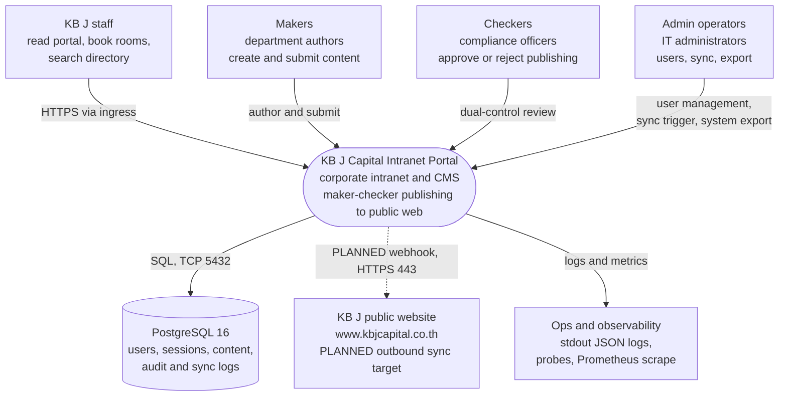

The portal is one organizational system used by four internal audiences
(roles `staff` > `maker` > `checker` > `admin` are enforced server-side, see
`05-sds.md` §3.1 and `09-rbac-design.md`). Its only persistent dependencies
are the company PostgreSQL instance (content, sessions, users, and the
governance logs) and, operationally, whatever collects its stdout JSON logs
and scrapes `/healthz`. The public website appears in the model because the
portal's headline governance feature is the maker-checker workflow that
clears content *for* it — but the outbound arrow is dashed: as built the
workflow manages status and logs only, and the actual outbound HTTP call is
`[PLANNED]` (`05-sds.md` §8.1).

---

## 2. Container diagram (C4 Level 2)

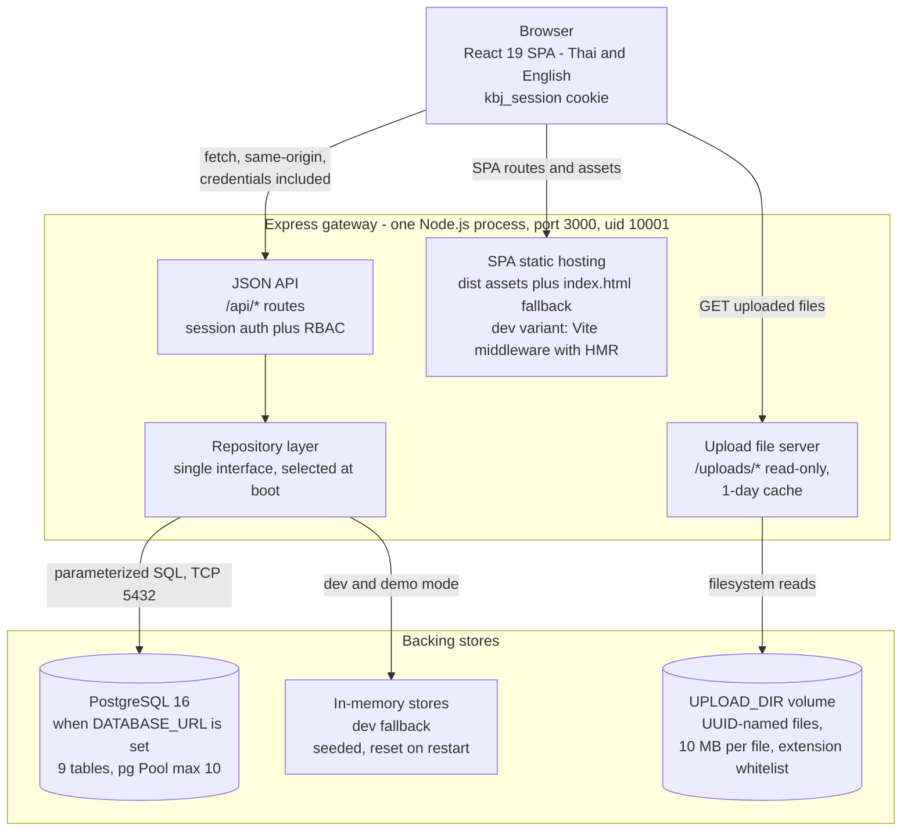

Everything inside the dashed boundary ships in **one container image** and
runs as **one process** listening on one port: the JSON API, the read-only
upload file server, and (in production) the built SPA all share the Express
gateway. The repository layer is the only component that talks to storage;
it has two interchangeable implementations behind one interface — PostgreSQL
(production) and seeded in-memory maps (development/demo) — chosen at boot
from the presence of `DATABASE_URL` (`05-sds.md` §3.2). Uploaded files never
enter the database; they live on a volume under `UPLOAD_DIR`
(`/app/uploads` in containers). In development the same process instead
mounts the Vite middleware, so there is no separate frontend dev server.

---

## 3. Component diagram — server.ts (C4 Level 3)

```mermaid
flowchart TB
    req["Incoming request, port 3000"]

    subgraph mw ["Global middleware chain - registration order, runs for every request"]
        direction TB
        m1["1. body parsers - express.json and urlencoded, 10 MB limit"]
        m2["2. security headers - nosniff, SAMEORIGIN, XSS, referrer, permissions"]
        m3["3. JSON request logger - time, method, path, status, durationMs, ip"]
        m4["4. API resource-id guard - clean 400 for missing or empty ids"]
        m1 --> m2 --> m3 --> m4
    end

    subgraph rlm ["Route-level middleware - applied per route"]
        l1["loginLimiter - login route only,<br/>5 failed attempts per min per IP, draft-7 headers"]
        l2["requireAuth - cookie parse, HMAC verify timing-safe,<br/>session resolve, isActive check"]
        l3["requireRole - per-route RBAC allowlist"]
        l4["requireResourceId - blank id defense on :id routes"]
    end

    subgraph routes ["Route handler groups"]
        h0["probes - healthz, readyz"]
        h1["auth and users - login, logout, me,<br/>user create, activate or deactivate"]
        h2["news plus maker-checker - CRUD,<br/>submit-approval, approve, reject"]
        h3["CMS content - banners, contacts, documents"]
        h4["rooms - list, book, release"]
        h5["upload - multipart via multer"]
        h6["governance - audit-logs, sync logs,<br/>sync trigger, system export"]
        h7["contract - openapi.json"]
    end

    subgraph services ["Cross-cutting services"]
        s1["session core - bcrypt cost 12, HMAC-SHA256 sign,<br/>7-day TTL, hourly sweeper, dummy-hash defense"]
        s2["recordAudit - actor always from session"]
        s3["sync log writer"]
        s4["upload pipeline - whitelist, MIME sanity, UUID names"]
    end

    subgraph repo ["Persistence"]
        i0["Repository interface"]
        i1["PostgresRepository<br/>PG_DDL at boot, seed-if-empty, SELECT 1 health"]
        i2["InMemoryRepository<br/>dev fallback, audit capped 5000"]
    end

    out["Response - JSON envelope, success data or error"]
    tail["Tail of the stack - /uploads static, API 404 JSON fallback,<br/>final error handler, SPA static or Vite dev middleware"]

    req --> mw
    mw --> rlm
    rlm --> routes
    routes --> services
    routes --> i0
    services --> i0
    i0 --> i1
    i0 --> i2
    routes --> out
    mw --> tail
```

This is the internal anatomy of the single `server.ts` file
(`05-sds.md` §2.2–2.3 gives the line-level inventory). A request flows
through four global middleware stages in a fixed order (body limits, then
headers, then logging, then id-shape defense), then through whichever
route-level guards the matched route declares — the rate limiter only on
login, `requireAuth` + `requireRole` on every protected route, and
`requireResourceId` on `:id` mutations. Handlers contain no storage logic:
they call cross-cutting services (session core, audit writer, sync-log
writer, upload pipeline) and the `Repository` interface, which fronts either
the PostgreSQL or the in-memory implementation. The tail of the stack keeps
API 404s as JSON, normalizes all errors into one envelope, and finally
serves `/uploads` and the SPA (or Vite in dev).

**Maker-checker status state machine** (routes `h2` + services `s2`, `s3`;
full prose in `05-sds.md` §3.3). Since **W2-1** (FR-NEWS-009; DCR-3/DCR-7
closed, commit `22023eb`) there is exactly **one path to `synced`** — the
BOT-compliant dual-control path. The Wave-1 direct-publish bypass (PATH A,
DCR-3) that v1.0.0 drew is closed:

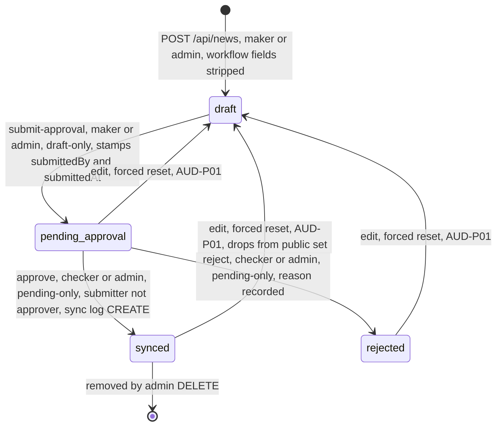

The four workflow fields (`externalSyncStatus`, `approvedBy`, `approvedAt`,
`syncToExternal`) are stripped from every create/update payload at the
validation layer (`stripNewsWorkflowFields`, server.ts L1288–1295) — no
role, admin included, can set publication state outside the checker approve
endpoint; submit-approval is legal from `draft` only, approve/reject from
`pending_approval` only, and the submitter may never approve their own
submission. Editing an item in any non-draft state resets it to `draft`
with the transition audited (AUD-P01). Decision record:
`05-sds.md` §3.3, §7 row 9, §8 row 0.

---

## 4. Deployment diagrams

### 4.1 Kubernetes (production target)

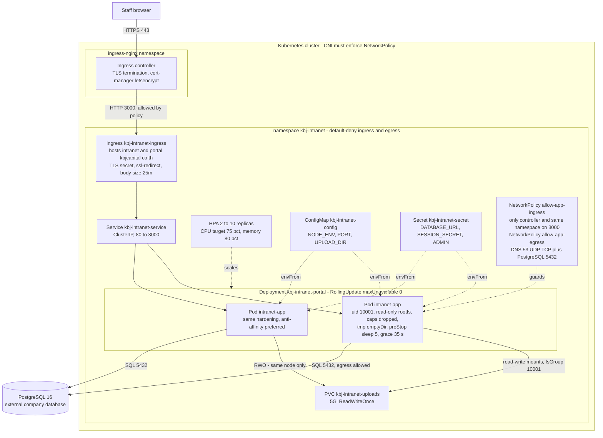

Production runs as a hardened Deployment in the `kbj-intranet` namespace:
traffic enters only through the ingress controller (TLS terminates there),
reaches the ClusterIP Service, and load-balances across 2–10 identical pods
(HPA on CPU/memory; `maxUnavailable: 0` keeps rolling updates zero-downtime).
Each pod is non-root (uid/gid 10001), has an immutable root filesystem with
all capabilities dropped, and runs the exact same image as Docker Compose.
Readiness (`/readyz`) is repository-aware, so a database outage removes pods
from rotation without restarting them (`05-sds.md` §3.2). The default-deny
NetworkPolicies reduce the attack surface to: ingress from the controller and
same-namespace pods on 3000, egress to cluster DNS and PostgreSQL 5432.
The uploads PVC is **ReadWriteOnce** — it can attach to a single node, so the
scheduler tends to co-locate replicas (preferred anti-affinity, not required);
scaling beyond that needs RWX or object storage (`05-sds.md` §5.4, §8.4).

### 4.2 Docker Compose (single host)

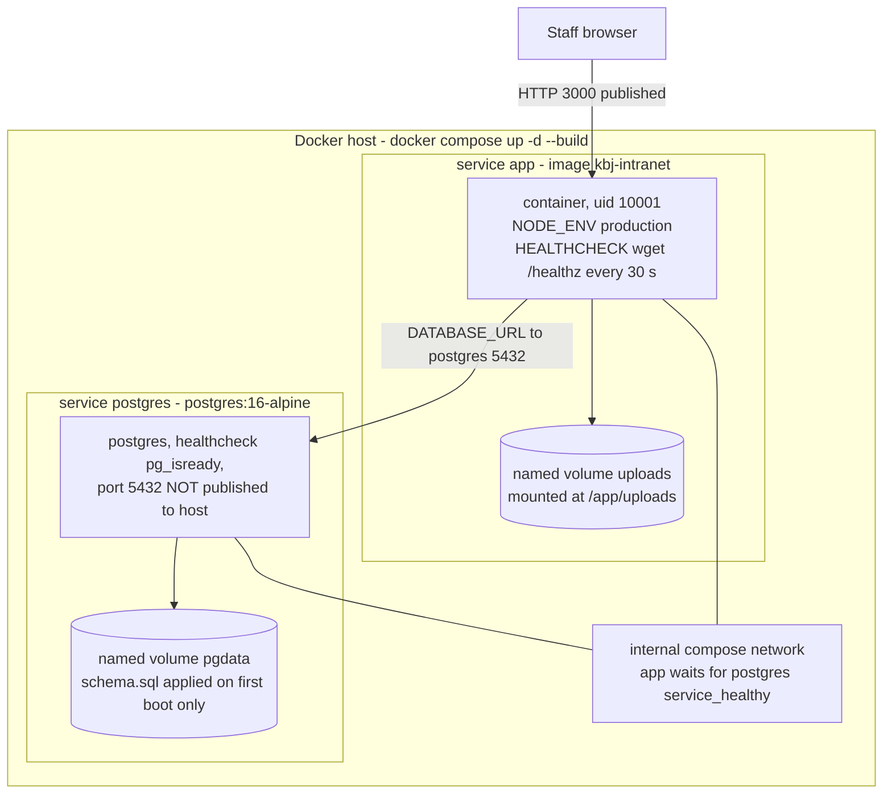

The single-host alternative runs the same image beside a PostgreSQL 16
container on one Docker network. The compose file hard-requires
`SESSION_SECRET` and `ADMIN_PASSWORD` (it refuses to start half-configured),
gates app start on the postgres health check, and applies `scripts/schema.sql`
automatically **only** to a freshly created `pgdata` volume — later schema
changes are a deliberate manual step (`05-sds.md` §5.2, §8.2). The database
port is deliberately unreachable from outside the host.

---

## 5. Dynamic views — sequence diagrams

### 5.1 Login (rate limit, bcrypt, dummy-hash timing defense, session issue)

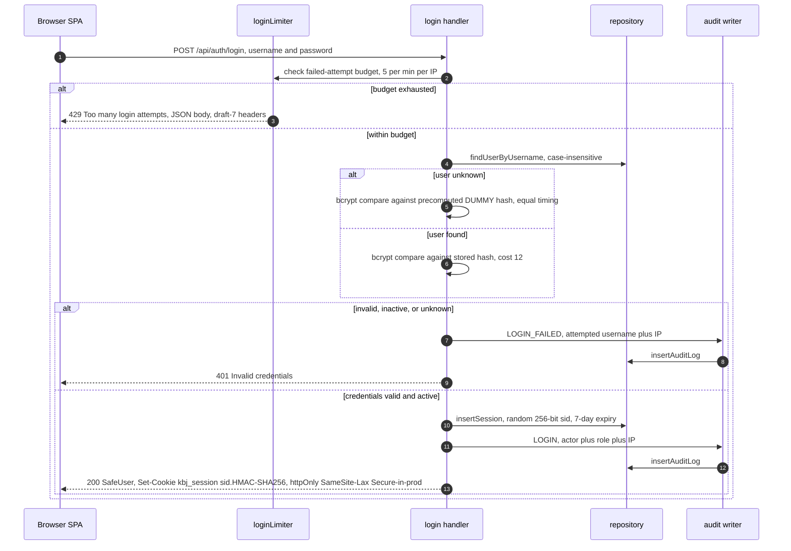

Login is the most defended single endpoint: the per-IP failure budget runs
before any credential work and only *failures* consume it, so brute force is
throttled while legitimate users never self-lockout. Unknown usernames are
compared against a precomputed dummy bcrypt hash so response timing cannot
enumerate accounts; deactivated accounts fail identically to wrong
passwords. On success the server stores a random session record and hands
the browser only an HMAC-signed, `httpOnly` cookie — every later request
re-resolves the session server-side, which is what makes deactivation
instant (`05-sds.md` §3.1). Both outcomes produce audit entries.

### 5.2 Maker-checker publish — the only path to live (submit → approve/reject → synced + audit)

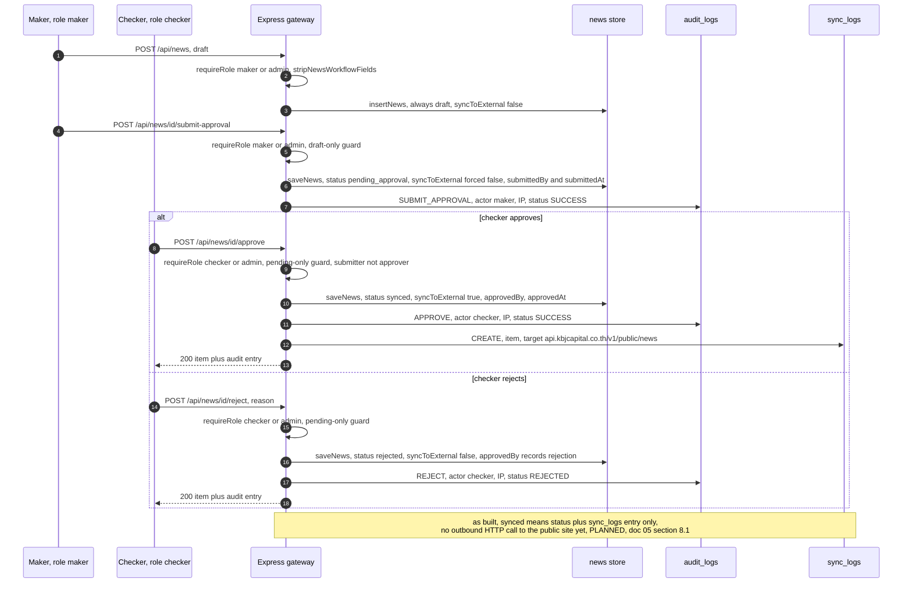

This is the **only** path to `synced` since W2-1 (FR-NEWS-009, DCR-3/DCR-7
closed, commit `22023eb`): the maker can never publish in one step —
create/update cannot set publication state (workflow fields stripped at the
validation layer) — and can never approve their own submission (`approve`/
`reject` require the `checker` or `admin` role and a different identity than
the submitter). The item is forced non-live while awaiting review, and the
checker's identity is stamped onto the item (`approvedBy`/`approvedAt`) and
into the audit trail on every transition; guard rejections and forced
edit-resets are also audited (AUD-P01). The sync-log row models the handoff
to the public site; the actual outbound webhook is `[PLANNED]` and will
require a new egress rule in the NetworkPolicy (`05-sds.md` §8.1).

### 5.3 Room booking

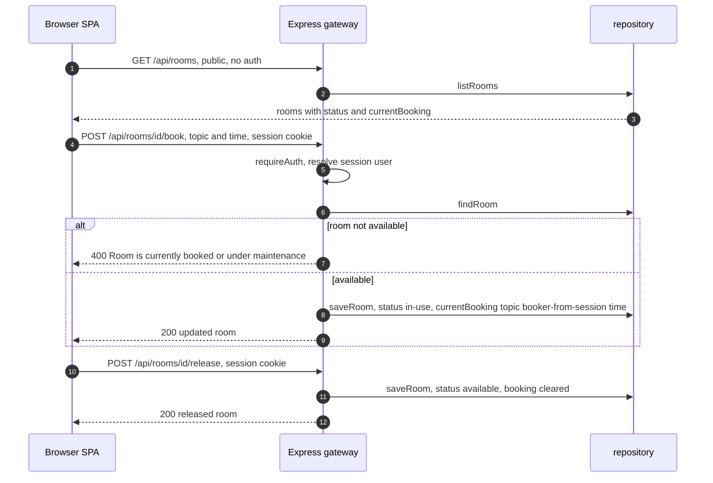

Room listings are public (the SPA renders the floor plan pre-login), but
booking and release require any authenticated staff member; the **booker
identity is taken from the resolved session**, never from the request body,
so one employee cannot book in another's name (`05-sds.md` §2.2, HANDOVER
§4). Availability is checked and written in one handler round-trip through
the repository; a room in `maintenance` or `in-use` is rejected with a clean
400.

### 5.4 File upload

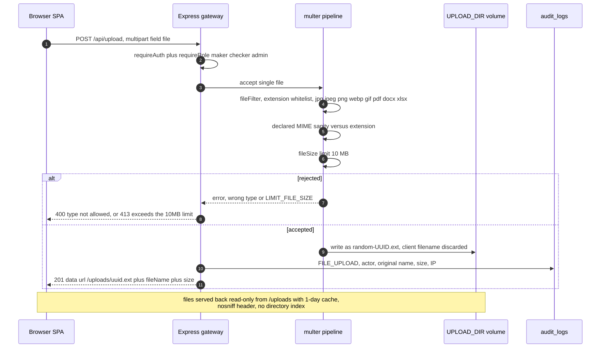

Uploads pass four independent gates before any byte is stored: role, size,
extension whitelist, and declared-MIME sanity (with `octet-stream` tolerated
for Office documents because browsers send it). Names are replaced with
random UUIDs so the client filename never reaches the filesystem — killing
traversal, collision, and executable-extension risks in one rule — and every
successful upload is audited with actor, original name, stored name, and
size (`05-sds.md` §3.4).

### 5.5 Graceful shutdown

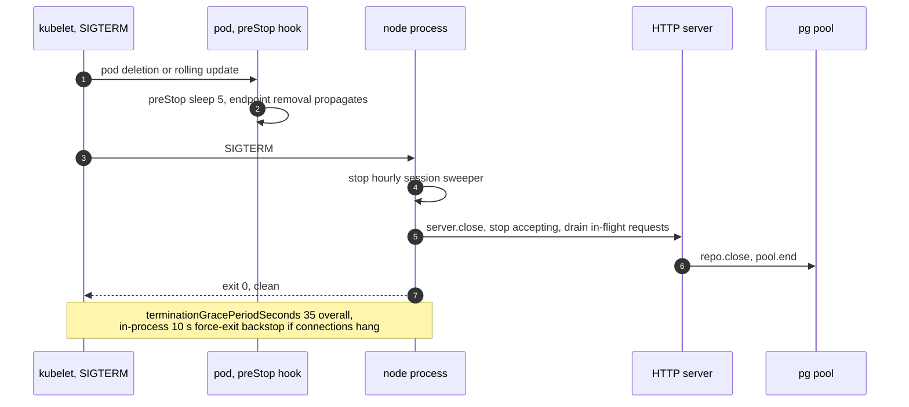

Rolling updates and node drains lose no requests: Kubernetes removes the pod
from endpoints and the `preStop` hook waits 5 s for that to propagate before
SIGTERM even arrives; the process then drains in-flight work, closes the
database pool, and exits 0. A 10-second in-process backstop guarantees
termination even with hung connections, well inside the 35-second grace
period (`05-sds.md` §5.5).

---

## 6. Data-flow diagram (incl. PDPA-relevant flows)

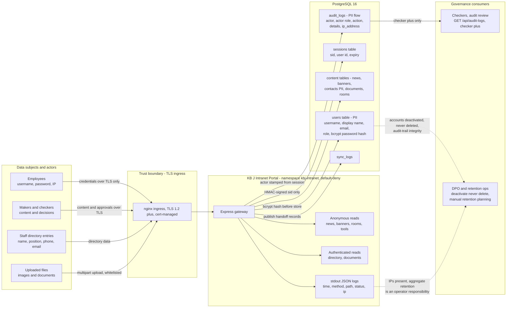

PDPA-relevant personal-data flows are called out explicitly. Direct PII
rests in three places: the `users` table (identity, role, and a bcrypt hash —
never a plaintext password), the `contacts` content table (business contact
details), and `audit_logs` (actor identity plus client IP per sensitive
action). Two secondary flows carry IPs: the append-only audit trail (which is
the accountability record PDPA asks for) and the operational stdout JSON
request log. Mitigations as built: TLS-only ingress, `httpOnly` session
cookies so PII-bearing tokens are script-invisible, actor names stamped
server-side (never client-supplied), audit access restricted to `checker`
and above, and accounts deactivated rather than deleted so audit references
stay resolvable — deliberate retention planning remains an operator duty
(`05-sds.md` §6.5, `10-audit-log-design.md`). Anonymous visitors can only
ever receive the public read flows (news, banners, rooms, tools), never
directory or document data.

---

## Appendix — diagram inventory and source mapping

| Diagram | Source of truth |
|---|---|
| §1 System context | `HANDOVER.md` §1–§2; `README.md` §6; roles in `server.ts` `ROLE_LABELS` L1392 |
| §2 Container | `server.ts` L37–46, L2537–2628; `src/api.ts`; `Dockerfile` |
| §3 Component | `server.ts` middleware L44–113, auth L1134–1370, routes L1410–2436, repos L135–1130 (`05-sds.md` §2.2–2.3) |
| §3 State machine | `server.ts` L1288–1295 (workflow-field strip), L1477–1788 (news routes incl. submit-approval/approve/reject); `src/types.ts` `externalSyncStatus` |
| §4.1 Kubernetes | `k8s/deployment.yaml`, `hpa.yaml`, `ingress.yaml`, `networkpolicy.yaml`, `pvc.yaml`, `service.yaml`, `configmap.yaml` |
| §4.2 Compose | `docker-compose.yml`; `README.md` §2 |
| §5.1 Login | `server.ts` L1211–1240 (`requireAuth`), L1356–1370 (`loginLimiter`), L2014–2058 (login route) |
| §5.2 Maker-checker | `server.ts` L1618–1788 (submit-approval/approve/reject) |
| §5.3 Room booking | `server.ts` L1881–1918 (rooms + book/release) |
| §5.4 File upload | `server.ts` L2166–2261 |
| §5.5 Graceful shutdown | `server.ts` L2595–2628; `k8s/deployment.yaml` L39, L129–132 |
| §6 Data-flow | `scripts/schema.sql` (PII columns); `server.ts` L58–79 (logs), L1372–1408 (audit); `k8s/networkpolicy.yaml` |

*End of Deliverable 6. Prose specification: `05-sds.md`.*
