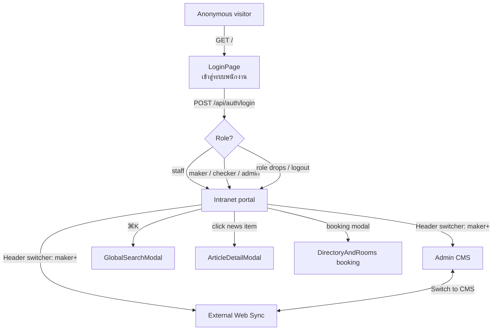

# UI Prototype Record — KB J Capital Intranet Portal

**Version:** 1.1.0 · **Status:** Draft (DCR-9 revision — implementation pending) · **Date:** 2026-09-10 · **Author:** worker-1 → Lead review → CTO approval (DCR-9 revision: worker-3)

> **Change log** — **1.1.0 (2026-09-10)**: **DCR-9** (lead ruling — Option C of `.omc/research/inert-sync-toggles-ux.md`; UI truth-aligned to W2-1 server semantics): the CMS "External Public Web Sync" form toggle and the row-level sync toggle are **removed from the target prototype** — both were inert at the API layer since W2-1 (server strips `syncToExternal` and workflow fields via `stripNewsWorkflowFields`, server.ts). A **"Withdraw from public…"** row action (visible only on `synced` items, maker+; confirm dialog naming the consequence) rides the existing audited PUT forced-reset semantics. Also documented as fixed: the **response-discard defect** (App.tsx `handleToggleExternalSync` applied the locally built object instead of the server response) and the **fabricated client-side SyncLog rows / overstated "now LIVE" toasts** (closes gap G-1). **1.0.0**: initial AS-BUILT record (Wave-1 gate, approved).

> This document records the **actual React SPA as the approved prototype** —
> there is no separate Figma/mockup artifact; the running application is the
> design source of truth. Everything below is documented AS BUILT from
> `src/App.tsx`, `src/components/*.tsx`, `src/index.css`, and `index.html`.
> Gaps and future UI work are explicitly marked `[PLANNED]` in §10.

## 1. Overview

- **Application:** single-page app (no router library) — one `App` component
  holds a `currentView` state of type `ViewMode = 'intranet' | 'admin-cms' | 'external-web'`
  (`src/types.ts`) and swaps the top-level view in place.
- **Exactly three views** (plus an anonymous login screen):
  1. **Intranet portal** — every signed-in user; anonymous visitors get the login screen.
  2. **Admin CMS** — `maker` and above; in-CMS capabilities differ per role.
  3. **External Web Sync** — `maker` and above; preview of what the public website receives.
- **Auth gate (`src/App.tsx`):** while the session check is in flight a splash
  shows the brand logo and "กำลังตรวจสอบเซสชัน / Checking session...";
  unauthenticated users get the full-screen `LoginPage`; authenticated users
  get the header + view shell.
- **RBAC in the UI:** `allowedViews` is computed from the session role
  (`roleAtLeast(user.role, 'maker')` gates the CMS and external views); an
  effect resets `currentView` to `'intranet'` whenever the current view is no
  longer permitted, so a role change or logout can never leave the app parked
  on a forbidden view.
- **Data hydration:** public slices (news, banners, rooms) fall back to
  bundled sample data visibly flagged with an offline badge; authenticated
  slices (contacts, documents, audit logs, sync logs) surface failures as
  error toasts instead of silently falling back.

## 2. Design system foundation

| Aspect | As built |
|---|---|
| Framework | Tailwind CSS 4 via `@tailwindcss/vite` (`@import "tailwindcss"` in `src/index.css`) — no tailwind.config, no tailwindcss-animate plugin |
| Brand palette | KBJ orange `#F97316` (primary), `#EA580C` (hover/active), cream `#FFF9F3` (footer/compliance widgets), golden strip `#FFBF00` (Kashjoy baseline bar), slate neutrals, semantic badge colors red/orange/blue/emerald/amber (`NewsItem.badgeColor`) |
| Header accent | Amber-500 pill for the active mobile view switcher |
| Typography | `Plus Jakarta Sans` (Latin) + `Prompt` (Thai) from Google Fonts, weights 300–800; body class in `index.html` sets the font stack; `<html lang="th">` |
| Icons | `lucide-react` (~54 icons used across views: Building2, FileText, PhoneCall, CalendarDays, ShieldCheck, Globe, Settings2, Sparkles, Users, Search, …) |
| Animation | `motion` package (Framer Motion successor) imported by components; plus a hand-rolled tailwindcss-animate-compatible subset in `src/index.css` (`@utility animate-in / fade-in / zoom-in-95 / slide-in-from-bottom-5`) driving modals, dropdowns, toasts |
| Accessibility touches | `prefers-reduced-motion: reduce` disables enter animations; `aria-label`s on CMS tabs, close buttons, and release-room actions; `role="status"` / `role="alert"` on CMS feedback banners |
| Custom utilities | `no-scrollbar` (hidden scrollbars on the horizontal mobile view switcher and CMS tab strip) |

## 3. Component inventory

All components live in `src/components/`; line counts from the working tree.

| Component | File (lines) | View(s) | Purpose | Role visibility |
|---|---|---|---|---|
| App shell | `src/App.tsx` (~1053) | all | View state, RBAC view gating, data hydration, all mutation handlers, toasts, footer, modals | all authenticated (login gate for anonymous) |
| Header | `Header.tsx` (439) | all | Brand bar, view switcher (Intranet / Self-Service CMS / External Web Sync), global search trigger (⌘K), urgent-alert bell, synced-count badge, user menu + logout; mobile: horizontal pill switcher | view buttons render only for roles allowed the target view |
| LoginPage | `LoginPage.tsx` (389) | anonymous | Full-screen split sign-in: brand panel + form ("เข้าสู่ระบบพนักงาน / Employee Portal Sign-in"), inline Thai/English field validation, server-error banner, clears password on failure and refocuses | anonymous only |
| HeroCarousel | `HeroCarousel.tsx` (135) | intranet | Auto-playing banner carousel (5.5 s interval, pauses on hover, only `isActive` slides), CTA button per slide | all authenticated |
| QuickToolsBar | `QuickToolsBar.tsx` (120) | intranet | Quick-launch tiles: HR System, IT-Request, KB J-E-DMS, Meeting Room Booking, Kashjoy Core Portal, Public Website (opens new tab or in-page anchor) | all authenticated |
| NewsSection | `NewsSection.tsx` (245) | intranet | "KB J News & Alerts" grid: featured urgent-alert card + category feed (KBJ news, finance literacy, lifestyle) | all authenticated |
| RegulatoryHub | `RegulatoryHub.tsx` (320) | intranet | Three-column compliance hub: NCB (National Credit Bureau), BOT Directives, PDPA & Legal Compliance | all authenticated |
| DirectoryAndRooms | `DirectoryAndRooms.tsx` (664) | intranet | Staff telephone directory (extension click-to-copy) + meeting-room cards with status; booking modal (topic / booker / time, Esc closes) and "ยกเลิกการจอง / Release Room" control | all authenticated (booking/release requires session; server: staff+) |
| GovernanceAndPolicies | `GovernanceAndPolicies.tsx` (307) | intranet | "Corporate Governance, Policies & Official Repository": company profile, vision & mission, board, business ethics, work rules, forms, handbook cards with version/size/download | all authenticated (documents API requires session) |
| GlobalSearchModal | `GlobalSearchModal.tsx` (362) | all (overlay) | Omnibox (⌘K / Ctrl+K, authenticated only): federated client-side search over news, contacts, documents, rooms; placeholder "Search phone extension, staff name, BOT news, meeting room, policy..." | authenticated |
| ArticleDetailModal | `ArticleDetailModal.tsx` (214) | all (overlay) | Reading modal for a news article or policy document (title, category badge, body, attachment) | all authenticated |
| AdminCMS | `AdminCMS.tsx` (3487) | admin-cms | Self-service CMS dashboard: KPI header, "Sync All to Public Web" (admin), 8 sub-tabs (see §7), full CRUD forms with inline errors and unsaved-changes guard | maker+ entry; per-tab gating below |
| ExternalPublicSyncView | `ExternalPublicSyncView.tsx` (789) | external-web | Public-website preview (Kashjoy marketing hero, synced news, "จัดการเนื้อหา / Switch to CMS" jump) | maker+ |
| BrandLogo | `BrandLogo.tsx` (82) | all | KB J Capital logo lockup (sizes sm/md/lg, optional subtitle) | all |

Supporting modules: `src/auth/AuthContext.tsx` (session context, `login`/`logout`, `roleAtLeast`), `src/api.ts` (typed fetch client + offline flag), `src/data/initialData.ts` (bundled Thai sample content and fallback data), `src/types.ts` (domain types incl. `ViewMode`, `UserRole`).

## 4. Navigation model



View-state rule: switching to a view the current role cannot see is
impossible (buttons hidden) and a state-level effect snaps `currentView` back
to `'intranet'` if permissions change under the user.

## 5. Key screens (ASCII wireframes)

### 5.1 Login screen (anonymous)

```
┌──────────────────────────────────────────────────────────────────────┐
│  ░░ left brand panel ░░              ┌──────────────────────────────┐│
│  ┌────────┐  KB J Capital            │  [orange login icon tile]    ││
│  │ Brand  │  Intranet Portal         │  เข้าสู่ระบบ                  ││
│  │ Logo   │  & Self-Service CMS      │  Sign in to continue to the  ││
│  └────────┘  corporate imagery,      │  intranet                    ││
│              gradient backdrop       │  ┌────────────────────────┐  ││
│                                      │  │ ชื่อผู้ใช้งาน / Username │  ││
│                                      │  └────────────────────────┘  ││
│                                      │  ┌────────────────────────┐  ││
│                                      │  │ รหัสผ่าน / Password     │  ││
│                                      │  └────────────────────────┘  ││
│                                      │  [   เข้าสู่ระบบ / Sign in  ] ││
│                                      │  · field errors inline:     ││
│                                      │    กรุณากรอกชื่อผู้ใช้งาน /   ││
│                                      │    Please enter your username│
│                                      └──────────────────────────────┘│
└──────────────────────────────────────────────────────────────────────┘
```

Validation is Thai-first bilingual; a rejected login shows
"เข้าสู่ระบบไม่สำเร็จ กรุณาตรวจสอบชื่อผู้ใช้งานและรหัสผ่านอีกครั้ง / Sign-in
failed...", clears the password, keeps the username, and refocuses the
password field. (Mobile: brand + heading "เข้าสู่ระบบพนักงาน / Employee
Portal Sign-in" stack above the form.)

### 5.2 Portal home (view 1 — Intranet)

```
┌───────────────────────────────────────────────────────────────────────────┐
│ HEADER: [Logo KB J Capital] [Intranet Feed][Self-Service CMS*][External   │
│          Web Sync*] · [🔍 Search ⌘K] [🔔] [ synced: N ] [user ▾ / ออกจากระบบ]│  * maker+
├───────────────────────────────────────────────────────────────────────────┤
│ HERO CAROUSEL  ┌────────────────────────────────────────────────────────┐ │
│ (auto 5.5s)    │  [badge] banner title / subtitle      [CTA button →]   │ │
│                │  ● ○ ○  (dots)                             image       │ │
│                └────────────────────────────────────────────────────────┘ │
│ QUICK TOOLS: [HR System][IT-Request][KB J-E-DMS][Room Booking][Kashjoy… ]│
├──────────────┬────────────────────────────────────────────────────────────┤
│ LEFT 3/12    │ RIGHT 9/12                                                 │
│ ┌──────────┐ │ ┌────────────────────────────────────────────────────────┐ │
│ │Corporate │ │ │ KB J NEWS & ALERTS                                     │ │
│ │Index     │ │ │ ┌─────────────┐ ┌─────────────┐ ┌─────────────┐        │ │
│ │ v2568.2  │ │ │ │⚠ URGENT     │ │ category    │ │ category    │ …      │ │
│ │──────────│ │ │ │  alert card │ │ news card   │ │ news card   │        │ │
│ │Facilities│ │ │ └─────────────┘ └─────────────┘ └─────────────┘        │ │
│ │ Phonebook│ │ ├────────────────────────────────────────────────────────┤ │
│ │ Rooms    │ │ │ REGULATORY & COMPLIANCE HUB                            │ │
│ │  14-15F  │ │ │ ┌──── NCB ────┐ ┌── BOT ──┐ ┌──── PDPA & Legal ────┐   │ │
│ │──────────│ │ │ │ updates     │ │directives│ │ & compliance news    │   │ │
│ │Governance│ │ │ └─────────────┘ └─────────┘ └──────────────────────┘   │ │
│ │ ข้อมูลบริษัท │ │ ├────────────────────────────────────────────────────┤ │
│ │ วิสัยทัศน์  │ │ │ DIRECTORY & MEETING ROOMS (id: directory-rooms)     │ │
│ │ คณะกรรมการ│ │ │ [search extension/name]  room cards w/ status chips   │ │
│ │ จรรยาบรรณ │ │ │  Kookmin Room · Jaymart Hall · Sukhumvit · …          │ │
│ │──────────│ │ │  [จองห้องประชุม / Book] · [ยกเลิกการจอง / Release Room]  │ │
│ │แบบฟอร์ม   │ │ ├────────────────────────────────────────────────────┤ │
│ │ข้อบังคับ  │ │ │ CORPORATE GOVERNANCE, POLICIES & OFFICIAL REPOSITORY  │ │
│ │คู่มือพนักงาน│ │ │ policy / work-rules / form / handbook / governance    │ │
│ └──────────┘ │ │  cards: title · version · size · [Download]            │ │
│ ┌──────────┐ │ └────────────────────────────────────────────────────────┘ │
│ │Compliance │ │                                                            │
│ │Directives │ │                                                            │
│ │ PDPA พ.ร.บ.│ │                                                            │
│ └──────────┘ │                                                            │
│ ┌──────────┐ │  (maker+ only)                                             │
│ │Content   │ │                                                            │
│ │Mgmt →CMS │ │                                                            │
│ └──────────┘ │                                                            │
├───────────────────────────────────────────────────────────────────────────┤
│ FOOTER: address · [Intranet Feed][Self-Service CMS*][External Web Sync*]   │
│  · www.kbjcapital.co.th ↗ · [Hotline 1258]                                 │
│ ══ golden #FFBF00 strip: © 2025 KB J Capital … KB Financial Group & Jaymart│
└───────────────────────────────────────────────────────────────────────────┘
```

Overlays available from any view: toast (bottom-right, 3.8 s), offline badge
(bottom-left: "โหมดออฟไลน์ — แสดงข้อมูลตัวอย่าง / Offline mode — showing
bundled sample data"), ArticleDetailModal, GlobalSearchModal.

### 5.3 News detail modal

```
        ┌──────────────────────────────────────────────┐
        │ [category badge]  [badgeColor chip]      [✕] │
        │ ข้อความหัวข้อข่าว (Thai title, titleEn alt)     │
        │ author · department · publishedAt · readTime │
        │ ──────────────────────────────────────────── │
        │ body (Thai prose, attachment link if any)    │
        │        [image if imageUrl present]           │
        └──────────────────────────────────────────────┘
```

Opens from: news cards, urgent-alert bell, regulatory hub columns, global
search, external-view article links. The same modal component renders policy
documents when opened from Governance & Policies.

### 5.4 Directory & rooms (booking / release)

```
 DIRECTORY (staff)                          MEETING ROOMS (14th–15th Fl.)
 ┌────────────────────────────────┐   ┌───────────────────────────────────┐
 │ 🔍 search name / extension     │   │ ┌───────────────┐ ┌───────────────┐│
 │ ┌────────────────────────────┐ │   │ │ Kookmin Room  │ │ Jaymart Hall  ││
 │ │ ชื่อ นามสกุล / Name EN      │ │   │ │ 8 seats · 14F │ │ Town Hall 40  ││
 │ │ position · department       │ │   │ │ ● available   │ │ ● in-use      ││
 │ │ ext. 1234 [click-to-copy] ✀ │ │   │ │ [จองห้อง /    │ │  topic/booker ││
 │ └────────────────────────────┘ │   │ │  Book Room]   │ │ [ยกเลิกการจอง  ││
 └────────────────────────────────┘   │ └───────────────┘ │  / Release]   ││
     booking modal (Esc closes):      └───────────────────┴───────────────┘
     ┌────────────────────────────┐    room status chips: available /
     │ หัวข้อการประชุม / Topic      │    in-use (shows currentBooking) /
     │  e.g. Q3 Sales Planning     │    maintenance (status managed in CMS)
     │ ผู้จอง / Booker (team)       │
     │  เวลา / Time                │
     │      [ยืนยัน / Confirm] [✕]  │
     └────────────────────────────┘
```

Booking and release call the API (`/api/rooms/:id/book|release`) and update
the card only after the server confirms; failures surface as error toasts.

### 5.5 Governance & policies

```
 ┌───────────────────────────────────────────────────────────────────┐
 │ 🏛 CORPORATE GOVERNANCE, POLICIES & OFFICIAL REPOSITORY           │
 │ ข้อมูลบริษัท วิสัยทัศน์ จรรยาบรรณ นโยบาย ข้อบังคับการทำงาน          │
 │ และแบบฟอร์มเอกสารรับรอง พ.ศ. 2568 - 2569                          │
 │ [Governance][Policy][Work Rules][Forms][Handbook]  ← filter chips │
 │ ┌──────────────┐ ┌──────────────┐ ┌──────────────┐                │
 │ │ doc title TH │ │ doc title TH │ │ NEW chip     │                │
 │ │ EN subtitle  │ │              │ │              │                │
 │ │ dept · v1.2  │ │ …            │ │ …            │                │
 │ │ PDF · 1.2 MB │ │              │ │              │                │
 │ │ [⬇ Download] │ │              │ │              │                │
 │ └──────────────┘ └──────────────┘ └──────────────┘                │
 └───────────────────────────────────────────────────────────────────┘
```

### 5.6 Global search modal (⌘K / Ctrl+K)

```
        ┌────────────────────────────────────────────────┐
        │ 🔍 Search phone extension, staff name, BOT     │
        │    news, meeting room, policy...           [✕] │
        ├────────────────────────────────────────────────┤
        │ ข่าวสาร / News        → matching article rows   │
        │ สารบัญ/เอกสาร / Documents → doc rows          │
        │ พนักงาน / Contacts    → directory rows (ext.)   │
        │ ห้องประชุม / Rooms    → room rows               │
        │  (select → opens ArticleDetailModal or jumps   │
        │   to the section with smooth scroll)           │
        └────────────────────────────────────────────────┘
```

Search is client-side over hydrated data (news, contacts, documents, rooms);
the shortcut only fires for authenticated users.

### 5.7 Admin CMS (view 2)

Entry: maker+ only (header button hidden for staff). Layout: KPI dashboard
header → admin toolbar → 8 horizontal sub-tabs → 8/4 content grid with a
right rail ("Admin Quick Actions" for admins).

```
┌────────────────────────────────────────────────────────────────────────────┐
│ SELF-SERVICE CMS · System Dashboard     [Sync All to Public Web] (admin)   │
│ KPI tiles: news · banners · contacts · documents · rooms · synced count    │
├────────────────────────────────────────────────────────────────────────────┤
│ TABS: [News & Alerts (n)] [Hero Carousel (n)] [Phone Directory (n)]        │
│  [Policies & Forms (n)] [Meeting Rooms (n)]                                │
│  maker+ ▸ all five tabs above                                              │
│  admin only ▸ [User Management (n)] (rose) [Public Sync Logs (n)] (blue)   │
│  checker+ ▸ [BOT / PDPA Audit Trail (n)] (purple)                          │
├───────────────────────────────────────────────────┬────────────────────────┤
│ ACTIVE TAB CONTENT (8/12 cols)                    │ QUICK ACTIONS (4/12)   │
│ ─ News studio:                                    │  admin: trigger sync,  │
│   list + [＋ New Announcement] editor form;       │  system export, user   │
│   draft: [+ Request Approval]; synced (maker+):   │  shortcuts             │
│   [Withdraw from public…→ draft, w/ confirm];     │  activity feed         │
│   checker+: [✓ Approve] [✕ Reject+reason] queue;  │                       │
│   admin only: [🗑 Delete]                         │                       │
│ ─ Hero Carousel: slide manager + add form         │                       │
│ ─ Phone Directory: contact cards + add form       │                       │
│ ─ Policies & Forms: upload form (10 MB,           │                       │
│   .jpg/.png/.webp/.gif/.pdf/.docx/.xlsx)          │                       │
│ ─ Meeting Rooms: status control (available/       │                       │
│   in-use/maintenance)                             │                       │
│ ─ User Management (admin):                        │                       │
│   [Create User Account] form (username, display   │                       │
│   name, email, role staff/maker/checker/admin),   │                       │
│   paginated account table, [Suspend/Reactivate]   │                       │
│   (deactivate/activate — never delete)            │                       │
│ ─ Public Sync Logs (admin): CREATE/UPDATE/DELETE/ │                       │
│   FORCE_SYNC rows w/ status + endpoint            │                       │
│ ─ Audit Trail (checker+): actor · role · action · │                       │
│   target · IP · result (append-only view)         │                       │
└───────────────────────────────────────────────────┴────────────────────────┘
```

Maker-checker in the CMS (**target state per DCR-9**, UI truth-aligned to the
W2-1 server semantics): every announcement is saved as `draft` — the form
carries **no publish/sync toggle** (the pre-W2-1 "External Public Web Sync"
toggle and its "Auto-sync enabled" chip are removed; they had been inert at
the API layer since W2-1, when the server began stripping `syncToExternal`
and the other workflow fields from every payload). Draft rows offer
"+ Request Approval" → `pending_approval`; checkers/admin see approve/reject
controls; approval stamps `approvedBy`/`approvedAt` and moves the item to
`synced`. Synced rows offer **"Withdraw from public…"** (maker+; visible only
while the item is `synced`): a confirm dialog names the consequence — the
item returns to `draft` and leaves the public site until re-approved — and
the action rides the existing PUT forced-reset semantics (audited, AUD-P01;
no server change). Unsaved
tab switches prompt "Unsaved changes — switching tabs will discard them.
คุณต้องการยกเลิกการเปลี่ยนแปลงทั้งหมดและเปลี่ยนแท็บหรือไม่?" so form input is
never silently lost; failed saves keep the form open with inline errors.

### 5.8 External Web Sync (view 3)

```
┌──────────────────────────────────────────────────────────────────────────┐
│ PUBLIC WEBSITE PREVIEW — what www.kbjcapital.co.th receives              │
│ [สมัครสินเชื่อเงินด่วน badge]                                    [CMS →] │
│  เรื่องเงินจบไว  ไว้ใจ KASHJOY !                                          │
│  ผู้ให้บริการสินเชื่อส่วนบุคคลจากประเทศเกาหลีใต้ ภายใต้การกำกับของ            │
│  ธนาคารแห่งประเทศไทย                                                      │
│  [สมัครสินเชื่อ →]                    (mobile-app mockup / mascot art)   │
│ ──────────────────────────────────────────────────────────────────────── │
│ SYNCED CONTENT: news / money / compliance tabs (filtered by              │
│  item.category — NOT the stored externalCategory field, which has no     │
│  consumer; its form select is removed with the DCR-9 toggle) —           │
│  article cards open the reading modal; items show sync status chips      │
│  (synced / pending_approval / rejected / draft)                          │
└──────────────────────────────────────────────────────────────────────────┘
```

Marketing CTAs in this preview are presentational (no handlers) — the view is
a fidelity preview of the public site, and "จัดการเนื้อหา" jumps back to the
CMS. Note: the intranet's sync state machine drives the status chips, but no
outbound HTTP call is performed yet (see §10 / RISK-001).

## 6. Thai / English handling

- Thai-first: `<html lang="th">`; UI chrome and content default to Thai with
  English inline as the secondary language, following the pattern
  "ชื่อผู้ใช้งาน / Username", "เข้าสู่ระบบ / Sign in", "ยกเลิกการจอง / Release
  Room", "โหมดออฟไลน์ — แสดงข้อมูลตัวอย่าง / Offline mode — showing bundled
  sample data".
- Domain types carry both languages: `NewsItem.title` (Thai) with optional
  `titleEn`; `DirectoryContact.name` (Thai) + `nameEn`.
- Fonts: Prompt covers Thai glyphs alongside Plus Jakarta Sans; both are
  loaded from Google Fonts with `display=swap` and `preconnect`.
- There is **no i18n framework** — bilingual pairs are hardcoded strings
  (see gap G-2).

## 7. Styling, motion, and interaction patterns

- **Tailwind 4 utility-first:** rounded-2xl cards, `shadow-xs/2xs` elevation,
  `border-slate-200/90` hairlines, gradient washes for the compliance widget
  (`from-[#FFF9F3] via-white to-[#FFF4EA]`), color-coded CMS tabs (orange
  default, rose = admin, blue = sync, purple = audit).
- **Motion:** `motion` library for view-level transitions plus the CSS
  `animate-in` subset for modals/toasts; carousel auto-advances every 5.5 s
  and pauses on hover; hover micro-interactions (chevron slide, icon color
  shift to brand orange) throughout.
- **Feedback:** single-slot toast queue at bottom-right (3.8 s auto-dismiss,
  a new toast cancels the previous timer, dismiss button, red border for
  errors / orange for info); offline badge at bottom-left whenever the API
  layer is unreachable; CMS inline error banners with `role="alert"` and
  success banners with `role="status"`.
- **Optimistic-free updates:** handlers throw on API failure; App state
  mutates only after the server confirms, so a failed save leaves prior state
  untouched. *(DCR-9 fix, target state: the sync-toggle path had violated
  this — `handleToggleExternalSync` applied the locally built object instead
  of the server response and fabricated local SyncLog rows / overstated
  toasts; with the toggles removed, state and feedback derive from the
  server-returned item — see §10 G-1.)*

## 8. Responsive behavior

- **Breakpoints:** base single column → `lg` (~1024 px) introduces the 12-col
  portal grid (3 sidebar / 9 feed), the CMS 12-col layout (8 content / 4
  rail), and larger type (`text-3xl sm:text-5xl` hero); `xl` keeps the CMS
  two-column layout stable.
- **Header:** desktop shows the inline view switcher; mobile collapses to a
  horizontally scrollable pill switcher (`no-scrollbar`) with the active pill
  in amber.
- **Hero:** text/image stack on small screens; carousel dots remain.
- **Login:** brand panel hides on mobile in favor of a stacked heading; form
  remains full-width.
- **Footer:** stacks vertically on mobile (`flex-col md:flex-row`), golden
  strip wraps.
- **Tables/lists:** CMS user list paginates; directory and room grids reflow
  from multi-column to single column.

## 9. Prototype verification path

Run the SPA exactly as the prototype reviewer would:

```bash
npm install
npm run dev            # http://localhost:3000 — in-memory dev mode
```

Sign in with the dev bootstrap admin (`admin` / `ChangeMe@KBJ2026!`), then
walk: login → portal home → ⌘K search → news modal → directory booking →
governance download → Admin CMS tabs (as admin) → External Web Sync. For
production parity use `docker compose up -d --build` (README §2). End-to-end
walkthrough script: `node tests/e2e-walkthrough.mjs` against a running
server.

## 10. `[PLANNED]` UI gaps (observed, not fixed)

These are documented deficiencies noticed while recording the prototype — no
code was changed (doc-first rule). Each is a Wave-2 candidate, to be routed
via the Lead/DCR process.

| # | Gap | Evidence / note |
|---|---|---|
| G-1 | **CLOSED — DCR-9 (Wave-2 lead ruling; implementation pending).** The sync-status UI overstated reality three ways: publish-promising toggles inert at the API layer (server strips `syncToExternal`/workflow fields since W2-1), "now LIVE on www.kbjcapital.co.th" toasts + optimistic local `SyncLog` rows fabricated for syncs that never happened, and the toggle handler applying local state instead of the server response. Fix per Option C: toggles removed; "Withdraw from public" (confirm dialog) rides the audited PUT forced-reset; state/toasts/logs derive from the server-returned item. Residual truth (not a gap): no outbound HTTP call is performed yet — the webhook stays `[PLANNED]` (RISK-001, doc 05 §8.1). | `.omc/research/inert-sync-toggles-ux.md` (evidence: App.tsx L227–242/260–275/290–325, AdminCMS.tsx L1574–1621/1821–1865); doc 12 TC-CMS-008 note; doc 05 §3.3. |
| G-2 | No i18n framework: bilingual strings are hardcoded, so coverage drifts (some toasts are English-only, e.g. "New Announcement Published to Employee Intranet successfully!"). | §6 above; a string-catalog extraction is a candidate refactor. |
| G-3 | Room booking takes free-text time ("เวลา / Time") with no calendar/time-slot picker or conflict detection in the UI; only current occupancy is shown. | `DirectoryAndRooms.tsx` booking modal fields. |
| G-4 | No dark mode; palette is fixed light. | §2. |
| G-5 | No password self-service UI (change/reset): staff depend on an admin; only account create/activate/deactivate exists. | AdminCMS User Management tab; README §5. |
| G-6 | Global search is client-side over already-hydrated data — not a server-side search endpoint; large datasets degrade recall/precision. | `GlobalSearchModal.tsx` filters arrays in memory. |
| G-7 | No list virtualization for large content lists (news grid, directory, audit trail view) beyond the paginated user table. | component inventory §3. |
| G-8 | External Web Sync CTAs ("สมัครสินเชื่อ") are decorative with no handlers — acceptable for a preview, but should be labeled as such if the view is ever user-facing. | `ExternalPublicSyncView.tsx`. |
| G-9 | Accessibility not formally audited: aria coverage is partial (CMS tabs/buttons have labels; portal cards' click targets are divs in places); no WCAG 2.1 AA claim yet. | candidate scope for Wave 3 test plan (deliverable 12). |
| G-10 | Upload feedback is binary (toast on success/failure) — no progress indicator or inline preview for images in the CMS forms. | AdminCMS Policies & Forms tab. |
| G-11 | Session-expiry UX: on 401 the CMS calls `onRequireAuth` (logout) rather than offering a re-authenticate-in-place flow with a draft buffer. | `AdminCMS` prop `onRequireAuth={logout}` in `App.tsx`. |

## 11. References

- `src/App.tsx` (view shell, RBAC gating, hydration, handlers)
- `src/components/*.tsx` (all components inventoried in §3)
- `src/index.css`, `index.html` (design tokens, fonts, animation utilities)
- `src/types.ts` (`ViewMode`, `UserRole`, domain types), `src/auth/AuthContext.tsx` (`roleAtLeast`)
- `README.md` §5 (views & roles), `HANDOVER.md` §4 (RBAC matrix, UI views)
- Companion docs: `01-project-plan.md` (§3 scope), `02-risk-register.md` (RISK-001)
